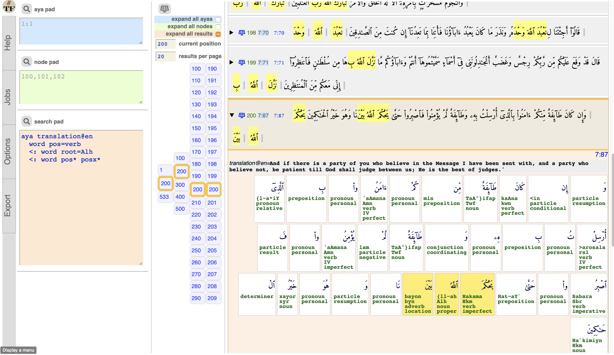

# Quran

This is a
[Text-Fabric](https://githubv.com/annotation/text-fabric) app
for working with the
[Quran](https://github.com/q-ran/quran) corpus.

Get started with the
[tutorial](https://nbviewer.jupyter.org/github/annotation/tutorials/blob/master/quran/start.ipynb).

It offers this [API](https://annotation.github.io/text-fabric/Api/App/).

